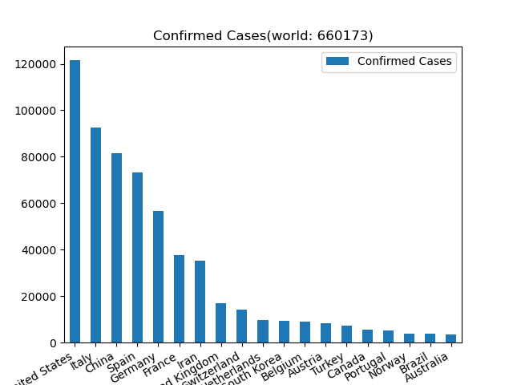
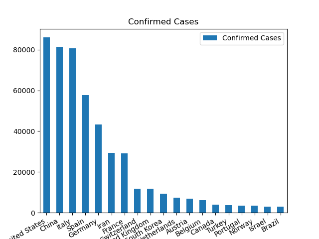
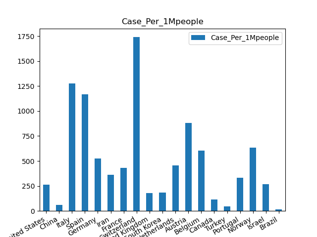
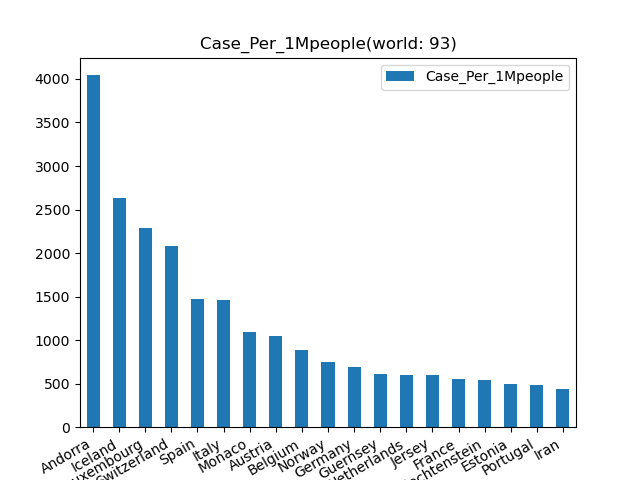
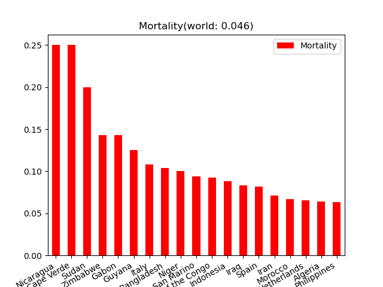

# WebSpider

### coronavirus
#### main.py
Using lxml to get data from website.
Reference:https://google.com/covid19-map/
 

#### main_v1.2.py
Using selenium to crawl data.
Requirment: pip install selenium  
Download proper verison of chromdriver.exe (https://chromedriver.chromium.org/downloads)
then put it in to you python install path(.\python36\Scripts\).
 
Coronavirus global data on 31/03/2020.
 

