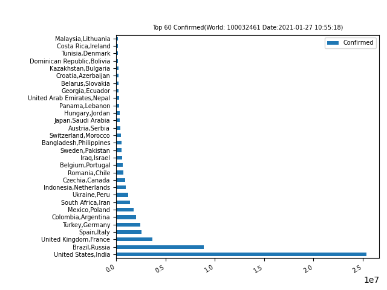
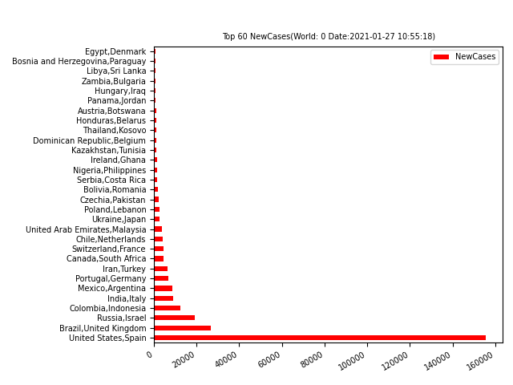
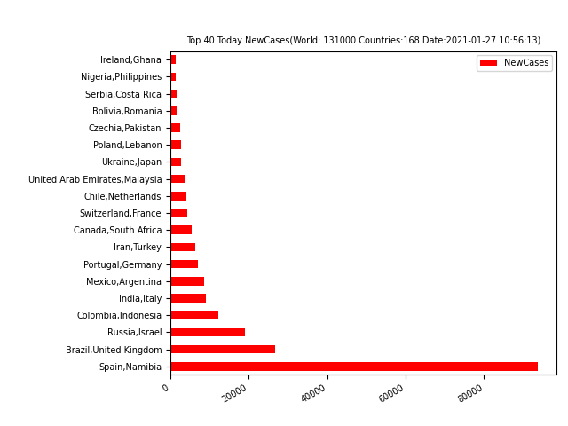

# COVID-19 Statistics

 

The added mortality column calculated by  this: df['Deaths'] / df['Confirmed']. 
Please note that this is not necessarily the correct definition. 
Reference:
https://google.com/covid19-map/  

#### main.py
Using lxml to get data from website.
 

#### main_v1.2.py
Using selenium to crawl data.
Requirment: pip install selenium  
Download proper verison of chromdriver.exe (https://chromedriver.chromium.org/downloads)
then put it in to your python install path(.\python36\Scripts\).
 
For detailed statistics of covid-19 in NZ, please refer to:
https://www.health.govt.nz/our-work/diseases-and-conditions/covid-19-novel-coronavirus/covid-19-current-situation/covid-19-current-cases

#### main_v1.3.py
Updated to adapt to the new google page. 
 

 

#### Statistics cases by time.
 

 

#### Prediction
 
World predicted confirmed cases by using LSTM algorithm. 
Source reference: https://ourworldindata.org/covid-cases
 

